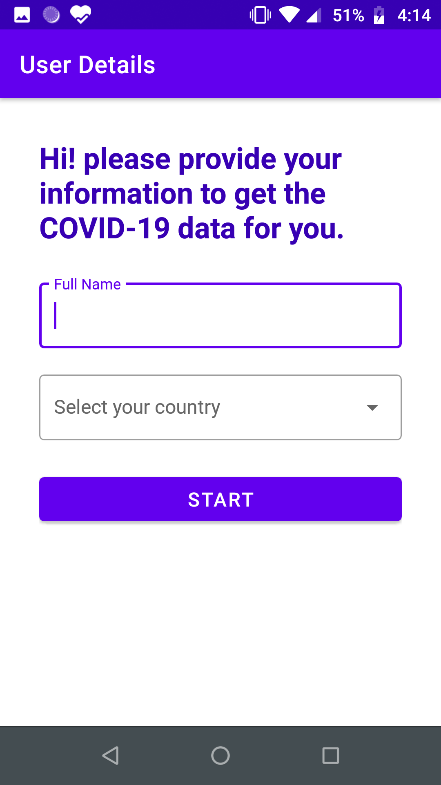
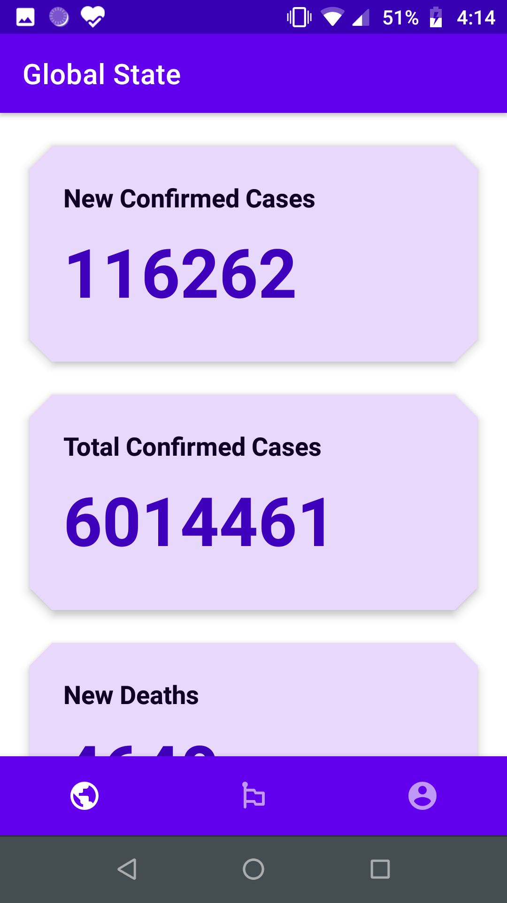
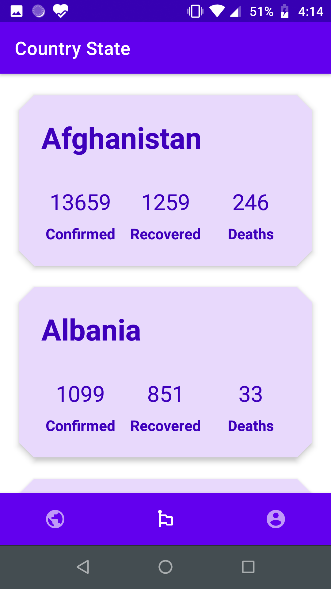
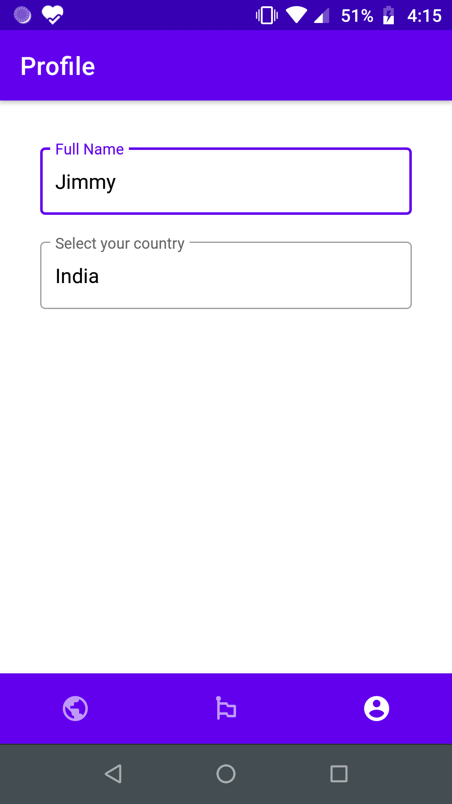

# COVID-19 Tracker Android Application

This application displays the COVID-19 tracking updates by country. It fetches the data from the [Coronavirus COVID19 API](https://documenter.getpostman.com/view/10808728/SzS8rjbc?version=latest).

# Screenshots
 
<table>
  <tr>
    <td></td>
    <td></td>
    <td></td>
    <td></td>
    <td></td>
  </tr>

 </table>
  
# Description

Kotling framwork is used to develop the app and the code are so simple. App uses the APIs to get latest update from server. The APIs are location on postman server and it is free.

Application includes components like **Android architecture components, Retrofit, Dependency Injection using Koin, Material Design, Bottom navigation along with the Navigation Component, other utils classes and MVVM Architecture**.
